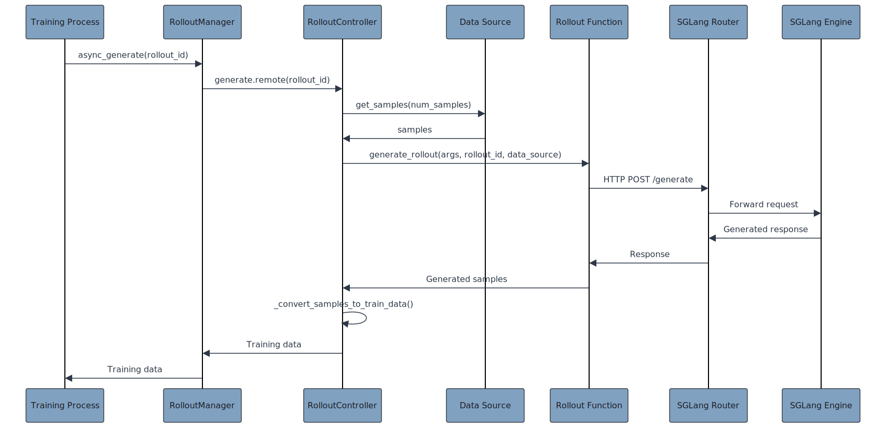

# Data Source with/without Buffer

## 1. 简介 
slime/ray/rollout_data_source.py 是rollout系统的数据源管理模块，负责为rollout engine提供训练数据。该文件定义了两个核心类：RolloutDataSource（基础数据源）和RolloutDataSourceWithBuffer（带缓冲的数据源）。



## 2. 核心Class和Function
### **1. RolloutDataSource 类**

#### **作用**
基础数据源类，负责从原始数据集加载数据，支持全局数据集管理和状态持久化。

#### **关键属性**
```python
class RolloutDataSource:
    def __init__(self, args):
        self.args = args
        self.epoch_id = 0          # 当前epoch ID
        self.sample_index = 0      # 全局样本索引
        self.sample_offset = 0     # 在当前epoch中的偏移量
        self.metadata = {}         # 元数据存储
        self.dataset = None        # 数据集对象
```

#### **初始化逻辑**
<details>
<summary>初始化逻辑</summary>

```python
if args.rollout_global_dataset:
    # 加载tokenizer
    tokenizer = AutoTokenizer.from_pretrained(args.hf_checkpoint, trust_remote_code=True)
    
    # 创建数据集
    self.dataset = Dataset(
        args.prompt_data,                    # 数据文件路径
        tokenizer=tokenizer,                 # tokenizer
        max_length=args.rollout_max_prompt_len,  # 最大prompt长度
        prompt_key=args.input_key,           # prompt字段名
        label_key=args.label_key,            # label字段名
        metadata_key=args.metadata_key,      # 元数据字段名
        tool_key=args.tool_key,              # 工具字段名
        apply_chat_template=args.apply_chat_template,  # 是否应用chat模板
        seed=args.rollout_seed,              # 随机种子
    )
    
    # 如果需要shuffle，进行shuffle
    if self.args.rollout_shuffle:
        self.dataset.shuffle(self.epoch_id)
else:
    # 不使用全局数据集，dataset为None
    self.dataset = None
```
</details>

**关键点**：
- 只有当`rollout_global_dataset=True`时才加载真实数据集
- 否则`dataset=None`，用于测试或特殊场景

#### **get_samples() 方法**

**作用**：从数据集中获取指定数量的样本组。

**核心逻辑**：
<details>
<summary>get_samples方法</summary>

```python
def get_samples(self, num_samples):
    samples = []
    
    if self.dataset is not None:
        # 分支1：使用真实数据集
        if self.sample_offset + num_samples <= len(self.dataset):
            # 情况1：当前epoch还有足够数据
            prompt_samples = self.dataset.samples[self.sample_offset : self.sample_offset + num_samples]
            self.sample_offset += num_samples
        else:
            # 情况2：当前epoch数据不足，需要进入下一个epoch
            prompt_samples = self.dataset.samples[self.sample_offset :]  # 取完当前epoch剩余数据
            num_samples -= len(prompt_samples)
            self.epoch_id += 1  # 进入下一个epoch
            
            # 重新shuffle数据集
            if self.args.rollout_shuffle:
                self.dataset.shuffle(self.epoch_id)
            
            # 从新epoch取剩余所需数据
            prompt_samples += self.dataset.samples[:num_samples]
            self.sample_offset = num_samples
        
        # 为每个prompt创建多个样本（n_samples_per_prompt）
        for prompt_sample in prompt_samples:
            group = []
            for _ in range(self.args.n_samples_per_prompt):
                sample = copy.deepcopy(prompt_sample)  # 深拷贝避免修改原始数据
                sample.index = self.sample_index
                self.sample_index += 1
                group.append(sample)
            samples.append(group)
    else:
        # 分支2：不使用真实数据集，创建空样本
        for _ in range(num_samples):
            group = []
            for _ in range(self.args.n_samples_per_prompt):
                sample = Sample(index=self.sample_index)
                self.sample_index += 1
                group.append(sample)
            samples.append(group)
    
    return samples
```
</details>

**关键特性**：
1. **Epoch管理**：自动处理epoch边界，支持数据集重shuffle
2. **多样本生成**：每个prompt生成`n_samples_per_prompt`个样本
3. **状态维护**：维护`sample_offset`、`epoch_id`、`sample_index`
4. **数据完整性**：使用深拷贝避免数据污染
5. **取出的samples格式为list[list[Sample]]**, 其中Sample定义与slime/utils/types.py。
<details>
<summary>Sample类</summary>

```python
class Sample:
    """The sample generated"""

    index: Optional[int] = None
    # prompt
    prompt: Union[str, list[dict[str, str]]] = ""
    tokens: list[int] = field(default_factory=list)
    # response
    response: str = ""
    response_length: int = 0
    label: Optional[str] = None
    reward: Optional[Union[float, dict[str, Any]]] = None
    loss_mask: Optional[list[int]] = None

    class Status(Enum):
        PENDING = "pending"
        COMPLETED = "completed"
        TRUNCATED = "truncated"
        ABORTED = "aborted"

    status: Status = Status.PENDING
    metadata: dict = field(default_factory=dict)

    def to_dict(self):
        value = self.__dict__.copy()
        value["status"] = self.status.value
        return value

    @staticmethod
    def from_dict(data: dict):
        data["status"] = Sample.Status(data["status"])
        return Sample(**data)

    def get_reward_value(self, args) -> float:
        return self.reward if not args.reward_key else self.reward[args.reward_key]
```
</details>

#### **add_samples() 方法**

**作用**：向数据源添加样本（基础类不支持）。

<details>
<summary>add_samples方法</summary>

```python
def add_samples(self, samples: list[list[Sample]]):
    raise RuntimeError(f"Cannot add samples to {self.__class__.__name__}. This is a read-only data source.")
```
</details>

**设计原理**：基础数据源是只读的，不支持动态添加数据。

#### **save() 方法**

**作用**：保存数据源状态到文件。

<details>
<summary>save方法</summary>

```python
def save(self, rollout_id):
    if not self.args.rollout_global_dataset:
        return  # 不使用全局数据集时不需要保存
    
    state_dict = {
        "sample_offset": self.sample_offset,  # 当前epoch中的偏移量
        "epoch_id": self.epoch_id,            # 当前epoch ID
        "sample_index": self.sample_index,    # 全局样本索引
        "metadata": self.metadata,            # 元数据
    }
    
    # 保存到指定路径
    path = os.path.join(self.args.save, f"rollout/global_dataset_state_dict_{rollout_id}.pt")
    os.makedirs(os.path.dirname(path), exist_ok=True)
    torch.save(state_dict, path)
```
</details>

**用途**：支持训练中断后恢复，确保数据顺序一致性。

#### **load() 方法**

**作用**：从文件加载数据源状态。

<details>
<summary>load方法</summary>

```python
def load(self, rollout_id=None):
    if not self.args.rollout_global_dataset:
        return  # 不使用全局数据集时不需要加载
    
    if self.args.load is None:
        return  # 没有指定加载路径
    
    path = os.path.join(self.args.load, f"rollout/global_dataset_state_dict_{rollout_id}.pt")
    if not os.path.exists(path):
        print(f"Checkpoint {path} does not exist.")
        return
    
    # 加载状态
    state_dict = torch.load(path)
    self.sample_offset = state_dict.get("sample_offset", 0)
    self.epoch_id = state_dict.get("epoch_id", 0)
    self.sample_index = state_dict.get("sample_index", 0)
    self.metadata = state_dict.get("metadata", {})
    
    # 重新shuffle数据集（如果需要）
    if self.args.rollout_global_dataset and self.args.rollout_shuffle:
        self.dataset.shuffle(self.epoch_id)
```
</details>

### **2. RolloutDataSourceWithBuffer 类**

#### **作用**
带缓冲的数据源类，继承自`RolloutDataSource`，增加了数据缓冲功能，支持数据重用和partial rollout。

#### **关键属性**
<details>
<summary>RolloutDataSourceWithBuffer初始化</summary>

```python
class RolloutDataSourceWithBuffer(RolloutDataSource):
    def __init__(self, args):
        super().__init__(args)
        self.buffer = []  # 数据缓冲区
        
        # 设置buffer过滤器
        if self.args.buffer_filter_path is None:
            self.buffer_filter = pop_first  # 默认：先进先出
        else:
            self.buffer_filter = load_function(self.args.buffer_filter_path)  # 自定义过滤器
```
</details>

#### **get_samples() 方法**

**作用**：优先从buffer获取数据，buffer不足时从原始数据集补充。

<details>
<summary>get_samples方法</summary>

```python
def get_samples(self, num_samples: int) -> list[list[Sample]]:
    # 1. 首先从buffer中获取样本
    samples = self._get_samples_from_buffer(num_samples)
    num_samples -= len(samples)
    
    # 2. 如果buffer不够，从原始数据集获取剩余样本
    if num_samples > 0:
        samples += super().get_samples(num_samples=num_samples)
    
    return samples
```
</details>

**数据获取优先级**：
1. **Buffer优先**：首先从buffer中获取数据
2. **数据集补充**：buffer不足时从原始数据集获取
3. **无缝集成**：buffer和数据集数据混合使用

#### **_get_samples_from_buffer() 方法**

**作用**：从buffer中获取指定数量的样本组。

<details>
<summary>_get_samples_from_buffer方法</summary>

```python
def _get_samples_from_buffer(self, num_samples: int) -> list[list[Sample]]:
    if len(self.buffer) == 0 or num_samples == 0:
        return []  # buffer为空或不需要样本
    
    # 使用buffer过滤器获取样本
    samples = self.buffer_filter(self.args, None, self.buffer, num_samples)
    return samples
```
</details>

**关键点**：
- 使用`buffer_filter`函数决定如何从buffer中选择样本
- 默认使用`pop_first`函数（先进先出）

#### **add_samples() 方法**

**作用**：向buffer添加样本组。

<details>
<summary>add_samples方法</summary>

```python
def add_samples(self, samples: list[list[Sample]]):
    if not samples:
        return
    
    # 验证输入格式
    assert isinstance(samples, list), f"samples must be a list, got {type(samples)}"
    assert isinstance(samples[0], list), f"the elements of samples must be list, got {type(samples[0])}"
    
    # 验证每个group的大小
    for i in range(0, len(samples)):
        assert (
            len(samples[i]) == self.args.n_samples_per_prompt
        ), f"the length of the elements of samples must be equal to n_samples_per_prompt, got {len(samples[i])} != {self.args.n_samples_per_prompt}"
        group = samples[i]
        self.buffer.append(group)  # 添加到buffer
```
</details>

**验证机制**：
1. **格式验证**：确保输入是`list[list[Sample]]`格式
2. **大小验证**：确保每个group包含正确数量的样本
3. **数据完整性**：确保buffer中的数据格式一致

#### **辅助方法**

<details>
<summary>辅助方法</summary>

```python
def update_metadata(self, metadata: dict):
    """更新元数据"""
    self.metadata.update(metadata)

def get_metadata(self):
    """获取元数据"""
    return self.metadata

def get_buffer_length(self):
    """获取buffer长度"""
    return len(self.buffer)
```
</details>

### **3. pop_first() 函数**

#### **作用**
默认的buffer过滤器，实现先进先出（FIFO）的数据获取策略。

<details>
<summary>pop_first函数</summary>

```python
def pop_first(args, rollout_id, buffer: list[list[Sample]], num_samples: int) -> list[list[Sample]]:
    num_to_pop = min(len(buffer), num_samples)  # 取buffer长度和需求量的较小值
    samples = buffer[:num_to_pop]               # 获取前num_to_pop个样本
    del buffer[:num_to_pop]                     # 从buffer中删除这些样本
    return samples
```
</details>

**特点**：
- **FIFO策略**：先进入buffer的数据先被取出
- **安全取数**：不会超出buffer实际长度
- **内存管理**：取出后立即从buffer中删除

## 数据流和调用关系

### **1. 调用链**
```
RolloutController.generate()
    ↓
RolloutDataSourceWithBuffer.get_samples()
    ↓
_get_samples_from_buffer() + super().get_samples()
    ↓
返回 list[list[Sample]]
```

### **2. Buffer使用场景**

#### **A. Partial Rollout**
<details>
<summary>Partial Rollout示例</summary>

```python
# 在sglang_rollout.py中，被abort的样本会写回buffer
if hasattr(data_source, 'add_samples') and len(filtered_data) > args.rollout_batch_size:
    rejected_samples = filtered_data[args.rollout_batch_size:]
    data_source.add_samples(rejected_samples)
```
</details>

### **3. 状态管理**

#### **A. 训练恢复**
<details>
<summary>训练恢复示例</summary>

```python
# 在train.py中
if args.rollout_global_dataset:
    ray.get(rollout_manager.controller.load.remote(args.start_rollout_id - 1))
```
</details>

#### **B. 检查点保存**
<details>
<summary>检查点保存示例</summary>

```python
# 在train.py中
if args.rollout_global_dataset:
    ray.get(rollout_manager.controller.save.remote(rollout_id))
```
</details>

## 设计特点总结

1. **分层设计**：基础数据源 + 缓冲扩展
2. **状态持久化**：支持训练中断恢复
3. **数据重用**：通过buffer机制提高数据利用率
4. **灵活过滤**：支持自定义buffer选择策略
5. **数据完整性**：严格的格式验证和状态管理
6. **Epoch管理**：自动处理数据集边界和重shuffle

## 关键配置参数

| 参数 | 说明 | 默认值 |
|------|------|--------|
| `rollout_global_dataset` | 是否使用全局数据集 | False |
| `rollout_shuffle` | 是否对数据集进行shuffle | False |
| `n_samples_per_prompt` | 每个prompt生成的样本数量 | 8 |
| `buffer_filter_path` | 自定义buffer过滤器路径 | None |
| `rollout_max_prompt_len` | 最大prompt长度 | - |
| `input_key` | 输入字段名 | - |
| `label_key` | 标签字段名 | - |

## 使用示例

### **基本使用**
<details>
<summary>基本使用示例</summary>

```python
# 创建数据源
data_source = RolloutDataSourceWithBuffer(args)

# 获取样本
samples = data_source.get_samples(32)  # 获取32个prompt组

# 添加样本到buffer
data_source.add_samples(rejected_samples)
```
</details>

### **自定义Buffer过滤器**
<details>
<summary>自定义Buffer过滤器示例</summary>

```python
# 定义自定义过滤器
def custom_buffer_filter(args, rollout_id, buffer, num_samples):
    # 按reward排序，取reward最高的样本
    sorted_buffer = sorted(buffer, key=lambda x: x[0].reward, reverse=True)
    return sorted_buffer[:num_samples]

# 在args中设置
args.buffer_filter_path = "path.to.custom_buffer_filter"
```
</details>

这个设计使得rollout系统能够高效地管理训练数据，支持复杂的训练场景如partial rollout和over-sampling。 
